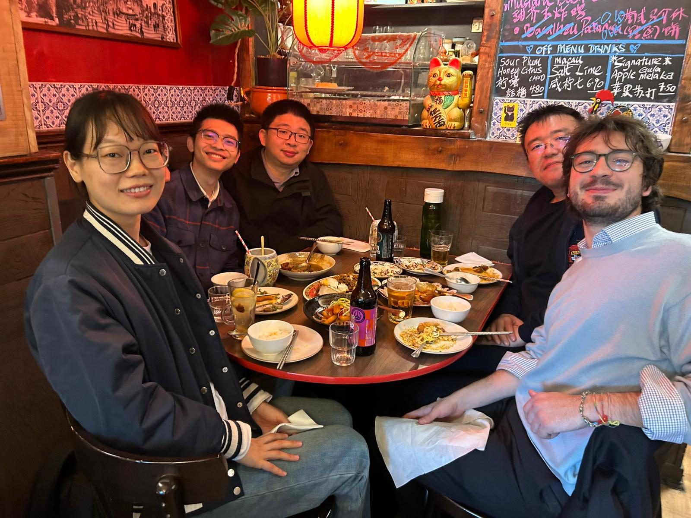

I've been invited to teach a minicourse on Finite Element approximations of eigenvalues problems at the University of Edinburgh, UK, by Prof. [Kaibo Hu](https://kaibohu.github.io/). The course was supported by the [ERC Starting Grant GeoFEM (Geometric Finite Element Methods)](https://kaibohu.github.io/geofem/).
The courses composes of 4 lectures, each lasting one hour and of practical exercises making use of the finite element library [Firedrake](https://www.firedrakeproject.org/).

In this short course, we explore finite element discretisations of eigenvalue problems involving non-normal operators, with a focus on the advection-diffusion equation as a guiding example. We begin by revisiting fundamental spectral notions—self-adjointness, normality, spectra, and pseudospectra—with particular emphasis on how an operator spectrum informs us about the physical behaviour of the time-dependent PDEs. The core of the course is devoted to the classical analysis of finite element approximations: we present in detail the Bramble-Osborn results for non-self-adjoint eigenvalue problems, including full proofs, and discuss their implications for convergence and approximation quality. For comparison, we also review the celebrated Babuška-Osborn theory in the self-adjoint case. If time permits, we will conclude with a discussion on iterative solvers and preconditioning strategies tailored to non-normal eigenvalue problems. The course requires basic background in functional analysis and finite element methods.

Lectures Times:
- May 13, 2025, 10:00 AM - 12:00 PM
- May 14, 2025, 2:00 PM - 4:00 PM
- May 16, 2025, 3:00 PM - 5:00 PM

Course Materials:
- [Lecture 1: Preliminaries, Self-Adjointness and Normality](https://www.uzerbinati.eu/assets/teaching/notes/st_lecture1.pdf)
- [Lecture 2: Spectra and Pseudospectra](https://www.uzerbinati.eu/assets/teaching/notes/st_lecture2.pdf)
- [Lecture 3: Approximation of Compact non-Normal Operators](https://www.uzerbinati.eu/assets/teaching/notes/st_lecture3.pdf)
- [Lecture 4: Variationally posed eigenvalue problems](https://www.uzerbinati.eu/assets/teaching/notes/st_lecture4.pdf)
- [Lecture 5: Spectra and Pseudospectra of the Advection-Diffusion Operator](https://www.uzerbinati.eu/assets/teaching/notes/st_lecture5.pdf)
- [Appendix A: Laplace Eigenproblem on a Pizza Slice](https://www.uzerbinati.eu/assets/teaching/notes/st_appendixA.pdf)
- [Appendix B: The Rayleigh quotient](https://www.uzerbinati.eu/assets/teaching/notes/st_appendixB.pdf)

Exercises and Solutions:
- [Exercise 1: FEM Approximation of the Laplace Eigenproblem](https://www.uzerbinati.eu/assets/teaching/sheets/st_sheet1.pdf): In this problem sheet, we will implement the finite element method (FEM) to approximate the eigenvalues and eigenfunctions of the Laplace operator on an interval. The convergence rate of the FEM is computed for both eigenvalues and eigenfunctions. We then consider the Laplace operator on the square and on the pizza slice. Answers: [Q1-Q4](https://www.uzerbinati.eu/assets/teaching/sheets/solutions/eig_laplace_interval.py), [Q5-Q6](https://www.uzerbinati.eu/assets/teaching/sheets/solutions/eig_laplace_square.py), [Q7](https://www.uzerbinati.eu/assets/teaching/sheets/solutions/eig_laplace_pizza.py)
- [Exercise 2: FEM Approximation of the Advection-Diffusion Eigenproblem](https://www.uzerbinati.eu/assets/teaching/sheets/st_sheet2.pdf): In this problem sheet, we will implement the finite element method (FEM) to approximate the eigenvalues and eigenfunctions of the advection-diffusion operator on an interval. The convergence rate of the FEM is computed for both eigenvalues and eigenfunctions. We then discuss the implication that the pseudospectra has on the solution of the Helmholtz equation. Answers: [Q1-Q3](https://www.uzerbinati.eu/assets/teaching/sheets/solutions/eig_advection_interval.py), [Q5-Q7](https://www.uzerbinati.eu/assets/teaching/sheets/solutions/eig_advection_square.py).

{: .align-center}